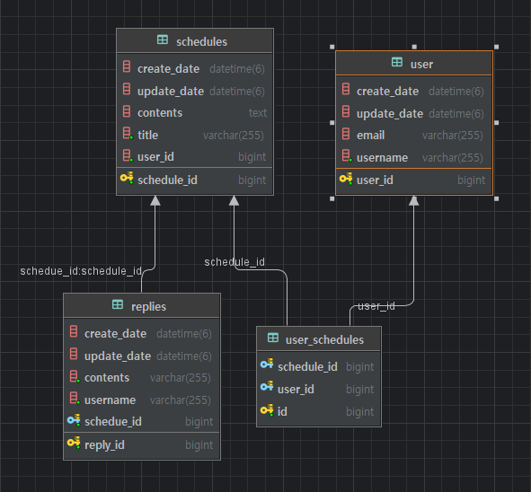

## 🌷나만의 일정 관리 앱 서버 만들기 - Upgrade Version

### 🏷️ API 명세서 

- **일정 API**

| 기능           | Method | URL               | request    | 등록 정보      |
| :------------- | ------ | ----------------- | ---------- | :------------- |
| 일정 등록      | POST   | /api/schedule     | 요청 body  | 등록 정보      |
| 일정 조회      | GET    | /api/schedule{Id} | 요청 param | 단건 응답 정보 |
| 일정 목록 조회 | GET    | /api/schedule     | 요청 param | 다건 응답 정보 |
| 일정 수정      | PUT    | /api/schedule{Id} | 요청 body  | 수정 정보      |
| 일정 삭제      | DELETE | /api/schedule{Id} | 요청 param | -              |

- **댓글 API**

| 기능      | Method | URL                                | request    | 등록 정보      |
| :-------- | ------ | ---------------------------------- | ---------- | :------------- |
| 댓글 등록 | POST   | /api/schedule/{scheduleId}/reply   | 요청 body  | 등록 정보      |
| 댓글 조회 | GET    | /api/schedule/{scheduleId}/replies | 요청 param | 단건 응답 정보 |
| 일정 수정 | PUT    | /api/reply/{replyId}               | 요청 body  | 수정 정보      |
| 일정 삭제 | DELETE | /api/reply/{replyId}               | 요청 param | -              |

- **사용자 API**

| 기능             | Method | URL                 | request    | 등록 정보      |
| :--------------- | ------ | ------------------- | ---------- | :------------- |
| 사용자 등록      | POST   | /api/users          | 요청 body  | 등록 정보      |
| 사용자 조회      | GET    | /api/users/{userId} | 요청 param | 단건 응답 정보 |
| 사용자 목록 조회 | GET    | /api/schedule       | 요청 param | 다건 응답      |
| 일정 수정        | PUT    | /api/users          | 요청 body  | 수정 정보      |
| 일정 삭제        | DELETE | /users/{userId}     | 요청 param | -              |

### ⛓️ERD

